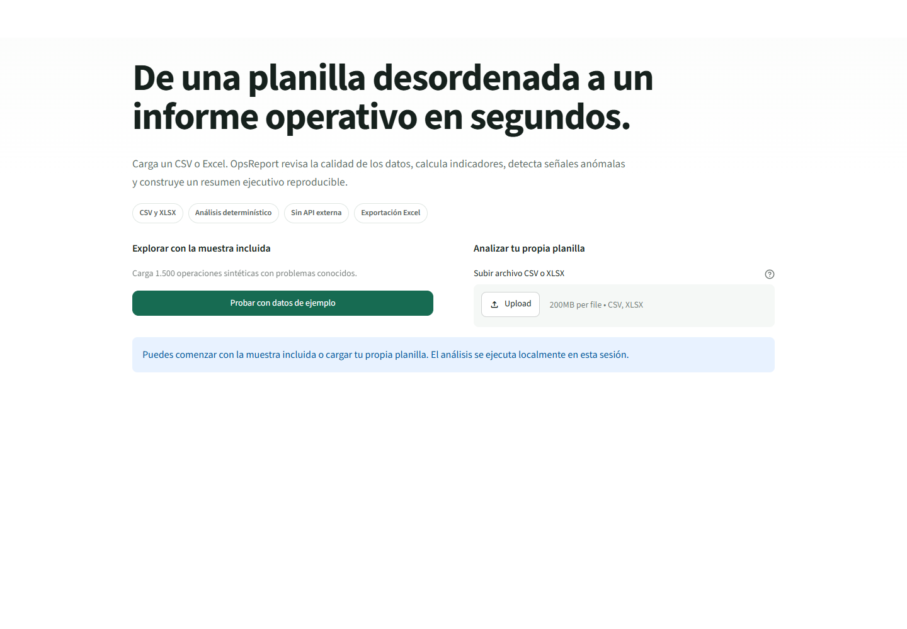
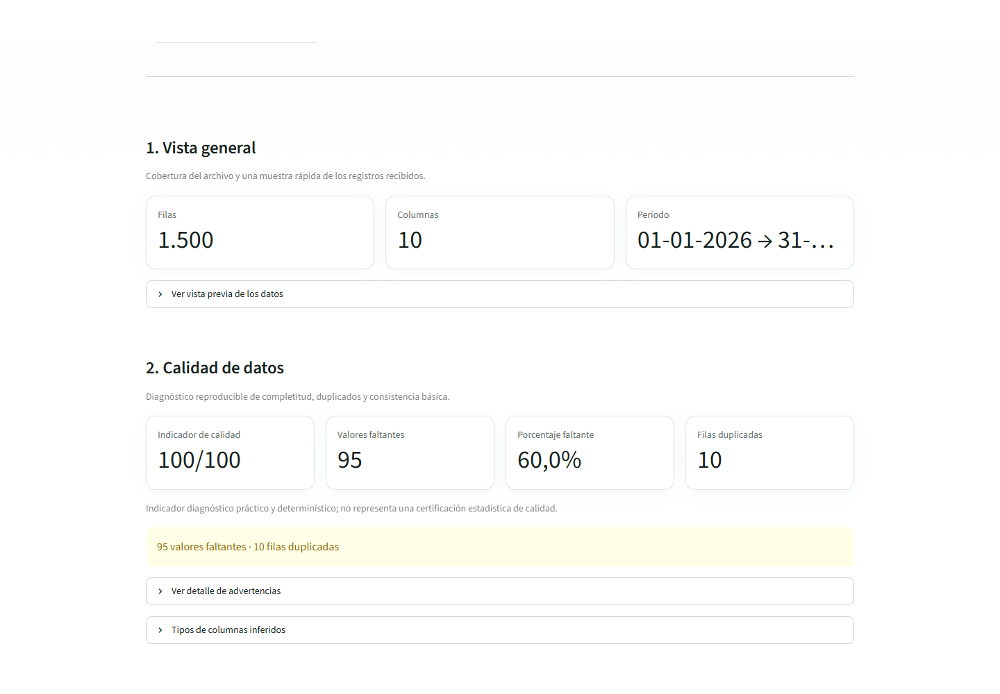
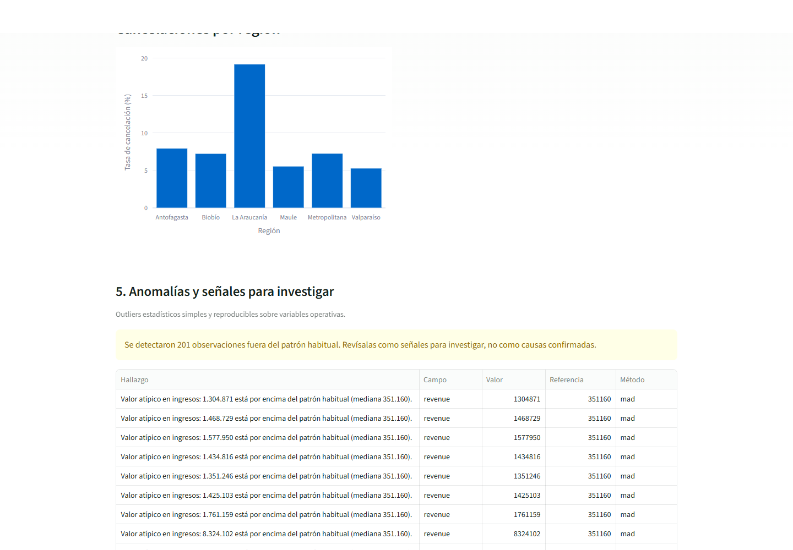
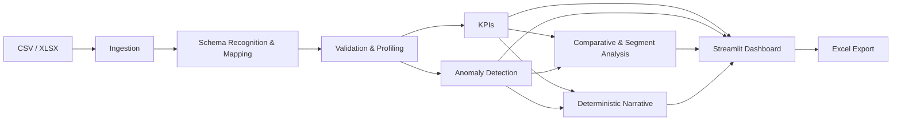

# OpsReport

**Turn a messy operational spreadsheet into a useful management report in seconds.**

OpsReport is a portfolio-grade Python application that converts CSV/XLSX operational data into data-quality diagnostics, business KPIs, interactive charts, anomaly findings, a deterministic executive summary, and an exportable Excel report.

The analytical layer is deliberately deterministic and independently testable. An external LLM is not required to calculate or explain the core results.

> User interface: Spanish · Code and tests: English · Python 3.12 validated



### What this project demonstrates

| Area | Evidence in the project |
| --- | --- |
| Python engineering | Modular ingestion, schema recognition, validation, profiling, metrics, anomaly, narrative, and export layers |
| Data analysis | pandas-based quality diagnostics, operational KPIs, segmentation, and robust outlier rules |
| Product development | Intentional Spanish UI, explainable column mapping, graceful incomplete-schema behavior, sample workflow, and export |
| Testing | Deterministic unit and end-to-end coverage on Python 3.12 |
| Reproducibility | Fixed synthetic-data seed, pinned runtime dependencies, and GitHub Actions CI |

---

## Demo

La aplicación incluye una muestra sintética reproducible de 1.500 operaciones, por lo que puede evaluarse sin preparar un archivo propio.

**Demo pública:** https://opsreport-victortapiavm.streamlit.app/





---

## El problema

En operaciones es habitual recibir planillas con filas duplicadas, valores faltantes, columnas inconsistentes y métricas que deben reconstruirse manualmente antes de poder responder preguntas básicas.

OpsReport reduce ese trabajo inicial a un flujo simple:

1. cargar un archivo CSV o XLSX, o usar la muestra incluida;
2. revisar o corregir el mapeo semántico de columnas cuando haga falta;
3. revisar la calidad de los datos;
4. calcular KPIs operativos;
5. explorar visualizaciones interactivas;
6. revisar anomalías determinísticas;
7. obtener un resumen ejecutivo trazable;
8. exportar los resultados a Excel.

La frase que guía el producto es:

> **De una planilla desordenada a un informe operativo en segundos.**

## Funcionalidades

- Carga de archivos `.csv` y `.xlsx`.
- Dataset sintético reproducible incluido en el repositorio.
- Reconocimiento semántico explicable de columnas comunes en español e inglés.
- Mapeo interactivo para planillas con nombres de columnas distintos o ambiguos.
- Mapeos parciales: los indicadores sin campos suficientes quedan explícitamente no disponibles.
- Comparación automática contra el período anterior con cambios absolutos y porcentuales, incluyendo manejo explícito de períodos parciales.
- Diagnóstico por región, categoría, canal y estado con ingresos, margen, cancelación, procesamiento y SLA.
- Umbrales configurables para SLA de procesamiento, cancelación alta y sensibilidad de anomalías temporales.
- Vista general con tamaño del dataset, período detectado y vista previa.
- Diagnóstico de valores faltantes y filas duplicadas.
- Inferencia práctica de tipos de columnas y detección de inconsistencias donde aplica.
- Indicador de calidad de datos entre 0 y 100.
- KPIs operativos calculados fuera de la capa UI.
- Visualizaciones interactivas con Plotly.
- Detección determinística de outliers por registro y desviaciones temporales contra una línea base histórica móvil.
- Resumen ejecutivo en español basado únicamente en hechos calculados.
- Exportación a Excel con contexto, resultados, comparaciones, segmentos, SLA, tendencias y datos analizados.
- Manejo de esquemas incompletos sin romper la aplicación.

## Dataset de ejemplo

`data/sample_operations.csv` contiene exactamente 1.500 registros sintéticos y no incluye información personal real.

Campos principales:

| Campo | Descripción |
| --- | --- |
| `order_id` | Identificador sintético del pedido |
| `date` | Fecha de operación |
| `region` | Región operativa |
| `channel` | Canal de origen |
| `category` | Categoría de producto |
| `status` | Estado del pedido |
| `units` | Unidades |
| `revenue` | Ingresos |
| `cost` | Costo |
| `processing_hours` | Horas de procesamiento |

La muestra incluye deliberadamente valores faltantes, duplicados, cancelaciones, tiempos de proceso extremos, valores numéricos atípicos, variación temporal y segmentos con peor desempeño. Se genera con una semilla fija mediante `data/generate_sample.py`.

## Arquitectura



```text
OpsReport/
├── app.py
├── src/
│   ├── ingestion.py
│   ├── schema.py
│   ├── analysis.py
│   ├── validation.py
│   ├── profiling.py
│   ├── metrics.py
│   ├── anomalies.py
│   ├── narrative.py
│   └── exports.py
├── data/
│   ├── generate_sample.py
│   └── sample_operations.csv
├── tests/
│   ├── test_ingestion.py
│   ├── test_schema.py
│   ├── test_app.py
│   ├── test_validation.py
│   ├── test_metrics.py
│   ├── test_anomalies.py
│   └── test_integration.py
├── requirements.txt
├── requirements-dev.txt
└── docs/
    ├── ROADMAP.md
    └── screenshots/
```

La separación es intencional:

- `ingestion.py`: lectura y errores de archivos;
- `schema.py`: reconocimiento explicable y resolución de roles semánticos;
- `analysis.py`: comparación temporal, diagnóstico por segmentos, SLA y baseline histórico;
- `validation.py`: calidad de datos y advertencias;
- `profiling.py`: resumen estructural e inferencia de tipos;
- `metrics.py`: KPIs;
- `anomalies.py`: reglas de anomalía;
- `narrative.py`: interpretación ejecutiva determinística;
- `exports.py`: exportación;
- `app.py`: presentación Streamlit.

La lógica de negocio se mantiene fuera de `app.py` para que sea reutilizable y comprobable con pruebas unitarias.

## Indicador de calidad de datos

OpsReport usa un indicador práctico de 0 a 100. Su objetivo es priorizar problemas visibles de una planilla, no certificar calidad estadística ni reemplazar una auditoría formal.

La fórmula es determinística y suma cuatro componentes:

| Componente | Peso máximo | Cálculo |
| --- | ---: | --- |
| Cobertura de columnas requeridas | 40 | proporción de columnas requeridas presentes |
| Completitud de campos requeridos presentes | 25 | proporción de celdas no vacías en esos campos |
| Validez numérica | 20 | proporción de valores no vacíos que se convierten correctamente a número |
| Unicidad de filas | 15 | `1 - (filas duplicadas / filas totales)` |

Un dataset vacío obtiene 0. Cada componente queda acotado por su peso y el resultado final se limita al rango 0–100. Las reglas viven en `src/validation.py`.

El dashboard muestra además los componentes observables —faltantes globales, duplicados e inconsistencias numéricas o de fecha— para evitar que el indicador se interprete de manera aislada. Las advertencias de fecha son diagnósticas y no alteran los pesos documentados del indicador.

## KPIs

Cuando existen las columnas necesarias, OpsReport calcula:

- ingresos totales;
- pedidos totales;
- ticket promedio;
- unidades totales;
- margen bruto;
- tasa de cancelación;
- tiempo promedio de procesamiento.

El margen bruto se calcula a partir de ingresos y costos. Si un archivo no contiene una columna requerida o sus valores no son interpretables, la métrica se informa como no disponible en lugar de provocar un error.

## Anomalías

La detección de anomalías usa reglas transparentes y reproducibles, como IQR y comparaciones contra baselines agregados. No se usa machine learning para etiquetar desviaciones simples.

Phase 4 agrega una segunda capa temporal: los ingresos diarios se comparan contra una mediana móvil calculada exclusivamente con observaciones anteriores y se exige además una desviación robusta basada en MAD. El umbral porcentual mínimo se puede ajustar desde la interfaz.

Los hallazgos describen lo que muestran los datos, por ejemplo un tiempo de procesamiento muy superior al rango habitual o una tasa de cancelación elevada en un segmento. OpsReport no atribuye causas.

## Resumen ejecutivo e IA

El resumen ejecutivo de V1 es **determinístico**. Cada afirmación proviene de métricas o hallazgos calculados previamente.

`src/narrative.py` admite una capa opcional de mejora de redacción para una futura integración con LLM, pero esa capa no es la fuente de verdad. La aplicación debe seguir funcionando sin API externa, claves, conexión a internet ni modelo generativo.

## Instalación

Requisitos:

- Python 3.12;
- `pip`;
- entorno virtual recomendado.

En PowerShell:

```powershell
cd OpsReport
python -m venv .venv
.\.venv\Scripts\Activate.ps1
python -m pip install -r requirements.txt
```

En macOS/Linux:

```bash
cd OpsReport
python3 -m venv .venv
source .venv/bin/activate
python -m pip install -r requirements.txt
```

## Ejecutar la aplicación

```bash
streamlit run app.py
```

Luego abre la URL local que muestra Streamlit y elige entre:

- **Probar con datos de ejemplo**
- **Subir archivo**

## Ejecutar las pruebas

```bash
python -m pip install -r requirements-dev.txt
pytest -q
```

Las pruebas cubren comportamiento determinístico de ingestión, reconocimiento y mapeo de esquema, validación, métricas, anomalías, exportación y el recorrido Streamlit de una planilla arbitraria. Incluyen errores de entrada, ambigüedad de encabezados, overrides del usuario, divisiones por cero y columnas faltantes.

## Decisiones de ingeniería

### Sin base de datos

El MVP analiza el archivo cargado en memoria. No existe una necesidad de persistencia que justifique una base de datos para este alcance.

### Sin autenticación ni infraestructura distribuida

OpsReport está diseñado como una aplicación pequeña de análisis. Agregar microservicios, colas, workers, Kubernetes o autenticación aumentaría la complejidad sin mejorar el objetivo del MVP.

### Cálculos determinísticos

Los KPIs, diagnósticos y anomalías usan funciones reproducibles. Esto permite verificarlos con pruebas unitarias y evita depender de una salida probabilística para cifras de negocio.

### Degradación controlada

Un archivo arbitrario puede no usar `revenue`, `cost`, `status` u otros nombres del esquema de ejemplo. OpsReport propone roles semánticos por reglas de encabezado explicables y permite corregirlos en la interfaz. Si un rol queda sin mapear, los módulos devuelven resultados parciales y métricas no disponibles sin fallar.

## Limitaciones actuales

- El reconocimiento semántico usa aliases y heurísticas de tipo transparentes; encabezados muy específicos del negocio pueden requerir mapeo manual.
- Los mapeos confirmados viven en la sesión actual y no se guardan como presets reutilizables.
- La inferencia de tipos es heurística.
- Las anomalías siguen siendo reglas estadísticas transparentes; la línea base móvil no modela estacionalidad compleja ni realiza forecasting.
- El export principal es Excel.
- PDF queda fuera del MVP para evitar una dependencia de generación frágil o pesada.
- No existe persistencia entre sesiones.

## Roadmap

El roadmap detallado se mantiene en [`docs/ROADMAP.md`](docs/ROADMAP.md).

Estado actual:

- **Phase 1 — Strong MVP:** completada.
- **Phase 2 — Portfolio Polish and Deployment:** completada; repositorio público, screenshots, CI Python 3.12 y demo Streamlit verificada.
- **Phase 3 — Arbitrary Spreadsheet Support:** completada.
- **Phase 4 — Reporting and Analytical Depth:** completada; comparación temporal, segmentos, SLA, umbrales configurables, anomalías históricas y export extendido.
- **Phase 5 — Optional AI Interpretation Layer:** planificada y opcional.

## Estado del proyecto

OpsReport es un proyecto de portafolio. No declara clientes, uso en producción ni métricas de negocio reales.
